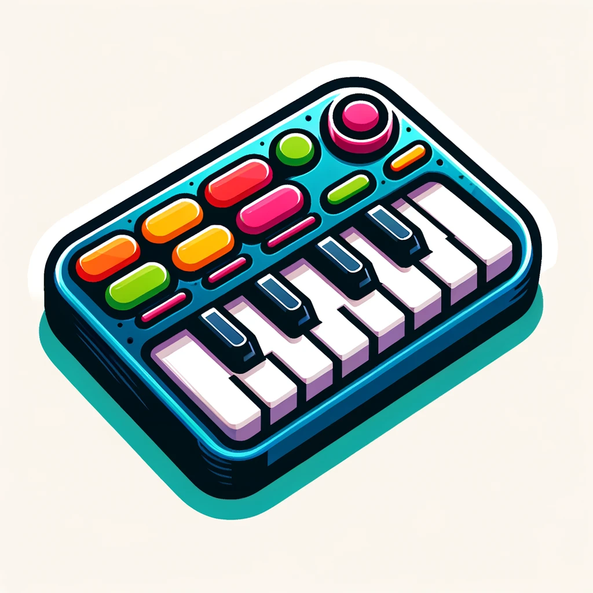

# MIDI Soundboard

So you have a MIDI board and would like to use it as a soundboard? Well, this is just the thing for you.



## How to use?

1. Download repo
2. Go to repo dir
3. Run `yarn install`
5. Create folder with sound files in it
6. Create `.env` file in the repo folder and fill in the following:

```.env
# Path to the folder you just created with all the sound files in it
ASSETS_PATH=/Your/Path/To/Sound/Files

# Adjust volume 0 - 1 (this only works on OSX at the moment 😅)
VOLUME = 0.1

# How often you can play sounds in milliseconds
RETRIGGER_DELAY_MS = 200
```

7. Run `yarn start`
8. Click a key on your MIDI board and follow instructions to assign it
9. Click the key again to hear the sound


## Good to know

The app saves your bindings in `save.json`. You can edit it or remove keys/the file to make the app forget bindings.